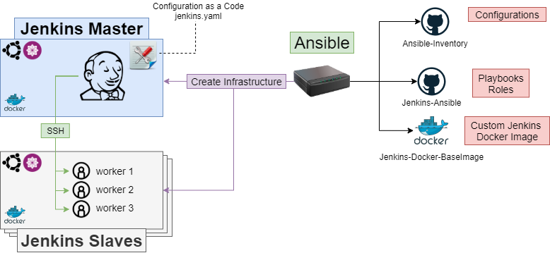

Jenkins-Ansible
=========
Create infrastructure for Jenkins as a Code

Konfiguracja Jenkinsa z poziomu kodu
=========


1. Jenkins przygotowuje maszynę do pracy
    - Konfiguracja sudo
    - Konfiguracja serwera SSH
    - Ustawianie hostname

      ! Mozna wyłaczyć ten krok używając flagi (input_role_enable_set_hostname: true/false)

    - Instalowanie paczek dla Ubuntu
    - Instalowanie paczek dla Centosa
    - Konfiguracja dockera dla Ubuntu
    - Konfiguracja dockera dla Centosa

      ! Instalowanie natywne podman (nie docker)

      ! Ustawienie SELinux

    - Tworzenie technicznego użytkownika
    - Tworzenie infrastruktury katalogów
    - Kopiowanie Certyfikatu SSL/TLS

2. Konfiguracja Jenkins Linux Slaves
    - Tworzenie grupy systemowej dla workerów
    - Tworzenie (n) workerów

3. Konfiguracja Jenkins Master
    - Generowanie konfiguracji dla Jenkinsa
        - kopiowanie klucze SSH
        - tworzenie pliku known_host dla połączeń SSH
        - generowanie jenkins.yaml - Configuration as a Code
    - Deploy docker jenkins image

Playbooki
=========
playbooks/Jenkins-InstallAll.yml - Instalowanie całego klastra

playbooks/Jenkins-Master-Configure.yml - Instalowanie Jenkins Mastera

playbooks/Jenkins-Slave-Linux-Configure.yml - Instalowanie Jenkins Slave

playbooks/test_connection.yml - Test połączenia wszystkich maszyn w klastrze

Inventory
=========
1. hosts.yml
    ```
    all:
      children:
        jenkins:
          children:
            jenkins_master:
              hosts:
                jenkins-master-centos.rachuna.net:
                jenkins-master-ubuntu.rachuna.net:
            jenkins_slave_linux:
              hosts:
                jenkins-slave-centos.rachuna.net:
                jenkins-slave-ubuntu.rachuna.net:
    ```

2. Konfiguracja grupy jenkins

    group_vars/jenkins_system_group.yml
    ```
    inventory_group_jenkins_slaves_group:
      name: jenkins_slaves
      gid: 44021

    ```
    group_vars/paths.yml
    ```
    inventory_group_jenkins_paths:
      volume_path: /volumes
      jenkins_home_path: /volumes/jenkins
      volume_jenkins_home: /volumes/jenkins-home
      jenkins_slaves_home_path: /volumes/jenkins-slaves
      ssl_cert_dir: /volumes/ssl
    ```
    group_vars/ssh_key.yml
    ```
    inventory_group_jenkins_ssh_key:
      private_ssh_key:           ""
      public_ssh_key:            ""
    ```
3. Konfiguracja grupy jenkins_master

    group_vars/jenkins_master/app_configuration.yml
    ```
    invenory_group_jenkins_master_app_configuration:
      jenkins_docker_image_path: wolfsea89/jenkins-master:1.0.0.485
      master_number_of_executors: 10
      httpPort: 443
      slaveAgentPort: 50000
      location:
        adminAddress: jenkins@localhost
        url: "http://jenkins-master.rachuna.net:443"           # ha-proxy address
      sharedlibraries:
        - name: "Sharedlibraries"
          branch: "feature/class"
          gitUrl: "git@github.com:wolfsea89/Jenkins-Sharedlibraries.git"
          credentialsId: "github"
    ```
    group_vars/jenkins_master/credentials.yml
    ```
    inventory_group_jenkins_master_credentials:
      jenkins_master:
        description:             "Jenkins Master private ssh key"
        type:                    "basicSSHUserPrivateKey"
        passphrase:              ""
        username:                "jenkins"
        privateKey:              "{{ inventory_group_jenkins_ssh_key.private_ssh_key }}"

      github:
        description:             "GitHub private ssh key"
        type:                    "basicSSHUserPrivateKey"
        passphrase:              ""
        username:                "<< github_jenkins >>"
        privateKey:              "{{ inventory_group_jenkins_ssh_key.private_ssh_key }}"

      github_token:
        description:             "GitHub Jenkins Token"
        type:                    "usernamePassword"
        username:                "<< github_user >>"
        password:                "<< token >>"

      docker_hub:
        description:             "Docker hub access token"
        type:                    "usernamePassword"
        username:                "<< docker_user >>"
        password:                "<< token >>"

      baseImage_services_AminPassword:
        description:             "Password for the administrator account added to dockerfile"
        type:                    "usernamePassword"
        username:                "<< admin >>"
        password:                "<< password"
    ```

4. Konfiguracja grupy jenkins_slave_linux

    brak

5. Konfiguracja hosta Jenkins master

    host_vars/jenkins-master-ubuntu.rachuna.net/certificates.yml
    ```
    inventory_host_jenkins_ssl_certificate:
      ca_crt:     "{{ inventory_group_all_certificates.ca_crt }}"
      server_crt: "{{ inventory_group_all_certificates.jenkins_master_ubuntu_crt }}"
      server_key: "{{ inventory_group_all_certificates.jenkins_master_ubuntu_key }}"
    ```
    host_vars/jenkins-master-ubuntu.rachuna.net/connection.yml
    ```
    ansible_host: jenkins-master-ubuntu.rachuna.net
    inventory_host_os_distribution: CentOS
    ```
    host_vars/jenkins-master-ubuntu.rachuna.net/technical_accounts.yml
    ```
    inventory_host_jenkins_technical_account:
      username: jenkins
      comment: "Jenkins - technical user account"
      shell: /bin/bash
      system_groups: wheel
      uid: 30001
      gid: 30000

    inventory_host_add_workers_to_system_groups:
      - jenkins
    ```

6. Konfiguracja hosta Jenkins master

    host_vars/jenkins-master-ubuntu.rachuna.net/certificates.yml
    ```
    inventory_host_jenkins_ssl_certificate:
      ca_crt:     "{{ inventory_group_all_certificates.ca_crt }}"
      server_crt: "{{ inventory_group_all_certificates.jenkins_master_ubuntu_crt }}"
      server_key: "{{ inventory_group_all_certificates.jenkins_master_ubuntu_key }}"
    ```
    host_vars/jenkins-master-ubuntu.rachuna.net/configuration_slave.yml
    ```
    inventory_host_jenkins_slave_app_configuration:
      workers: 5
      executors: 1
      labels:
      - slave_linux
      - slave_ci_build
      - slave_ci_publish
      - slave_ci_docker
    ```
    host_vars/jenkins-master-ubuntu.rachuna.net/connection.yml
    ```
    ansible_host: jenkins-master-ubuntu.rachuna.net
    inventory_host_os_distribution: CentOS
    ```
    host_vars/jenkins-master-ubuntu.rachuna.net/technical_accounts.yml
    ```
    inventory_host_jenkins_technical_account:
      username: jenkins
      comment: "Jenkins - technical user account"
      shell: /bin/bash
      system_groups: wheel
      uid: 30001
      gid: 30000

    inventory_host_add_workers_to_system_groups:
      - jenkins
    ```